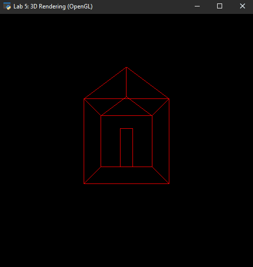
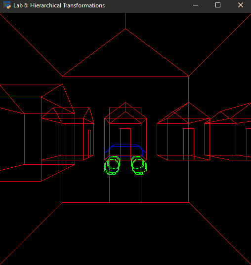

# 3D Graphics with OpenGL
This project shows usage of [OpenGL](https://www.opengl.org/) to render 3D vector graphics.

This is achieved by setting up the world-to-camera with projection (perspective and orhographic) and viewport transformations.
Additionally, tranformation hierarchies are used to move the car and it's tires.

To view the implementation, see [lab5.py](lab5.py) and [lab6.py](lab6.py)

## Results

---

## User Interface Controls

Key | Action
:---: | :---
a  | Move left
d  | Move right
w  | Move forward
s  | Move backward
q  | Turn left
e  | Turn right
r  | Move up
f  | Move down
h  | Return to the original "home" position and orientation, set time to 0
o  | Switch to orthographic projection
p  | Swtich to perspective projection
